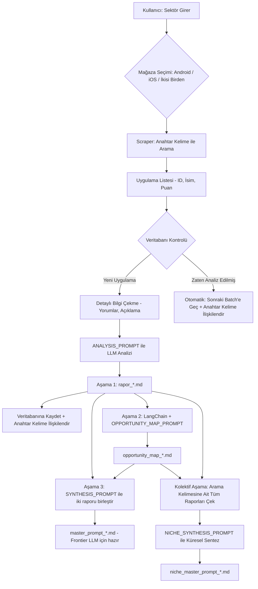

# 🕵️‍♂️ Market Gap Analyzer AI - SaaS Dönüşüm Otomasyonu

[](https://www.python.org/)
[](https://opensource.org/licenses/MIT)

**Market Gap Analyzer AI**, Google Play Store ve Apple App Store'daki sektör lideri uygulamaları tersine mühendislik ile analiz eden, yapay zeka destekli bir stratejik pazar araştırması otomasyonudur. Bu araç, OpenRouter üzerindeki ücretsiz modelleri kullanarak sadece veri toplamakla kalmaz; kıdemli bir ürün yöneticisi gibi düşünerek, size **SaaS ürünlerine dönüştürebileceğiniz niş pazar fırsatlarını `.md` formatında raporlar.**

Projenin kalbi, belirlediğiniz prompt stratejisiyle çalışır. Yapay zeka, bir uygulamanın zayıf yönlerini, kullanıcı sürtünmelerini (friction) ve görmezden gelinen ideal müşteri profilini (ICP) bularak, sizin için agresif bir pazar payı alma planı oluşturur.

---

## 🎯 Projenin Amacı

Geleneksel pazar araştırması haftalar sürer ve yüzeysel kalır. Bu otomasyon ile:

1.  **Otomatik Keşif:** Belirlediğiniz anahtar kelimeyle ilişkili en popüler uygulamaları anında tespit edin.
2.  **Stratejik Zeka:** Kıdemli bir Product Manager'ın analitik bakış açısını, OpenRouter üzerinden seçtiğiniz model ve spesifik prompt ile her uygulamaya uygulayın.
3.  **Tekrarı Önleme:** Dahili SQLite veritabanı, daha önce analiz ettiğiniz uygulamaları hatırlar. İkinci kez API/Token harcamaz ve zaman kaybettirmez.
4.  **Hazır SaaS Planı:** Her raporun sonunda, sizin için tanımlanmış "Çekirdek ICP" ve "10x Değer Teklifi Sunan AI Çözüm Stratejisi" hazır olarak gelir.

---

## 📋 Temel Özellikler

-   **Çift Mağaza Desteği:** `google-play-scraper` ve `app-store-scraper` ile her iki büyük platformu tarar.
-   **Dinamik Dil/Ülke Geri Dönüşü (Fallback):** Türkiye (`tr`) mağazasında puan/değerlendirme bulunmayan veya yetersiz yorum alan uluslararası uygulamaların verilerini, otomatik olarak ABD (`en`/`us`) mağazasından çeker.
-   **App Store Yorum Desteği:** Apple App Store için RSS müşteri değerlendirmesi beslemesi üzerinden en az 10 kelimelik kaliteli yorumları çeker.
-   **Yıldız Filtresi (`--stars`):** Belirlenen puanın (veya üzeri) altındaki uygulamaları analiz etmeden doğrudan atlar. Bu şekilde atlanan uygulamalar veritabanına kaydedilmez (gelecekte farklı bir filtreyle yeniden taranabilir).
-   **Akıllı Skip/Veri Filtreleme:** Fallback sonrasında bile hiç puanı veya yorumu bulunmayan uygulamaları analiz etmeden doğrudan atlar ve veritabanına `skipped` olarak işaretleyerek sonraki taramalarda atlanmalarını sağlar.
-   **Veritabanı Katmanı (SQLite):** Analiz geçmişini `analiz_gecmisi.db` içinde tutar. Aynı uygulama ID'si tekrar analiz edilmez.
-   **Sektör Bazlı Arama:** "Meditasyon", "Tedarik Zinciri", "Dijital Pazarlama" gibi istediğiniz herhangi bir anahtar kelime ile araştırma başlatabilirsiniz.
-   **Otomatik Kesintisiz Arama ve Sayfalama:** Yıldız filtresine takılan, yetersiz veri nedeniyle atlanan veya zaten analiz edilmiş uygulamalar elendikçe program durmaz. Belirlenen `--limit` sayısında başarıyla analiz edilmiş uygulama sayısına ulaşana veya arama sonuçları tükenene kadar otomatik olarak sayfalama yaparak (offset'i artırarak) taramaya devam eder.
-   **Prompt Tabanlı Derin Analiz:** Sizin sağladığınız veya varsayılan olarak gelen "Rakip Tersine Mühendislik" prompt'unu kullanır. Bu sayede analiz derinliği tamamen sizin kontrolünüzdedir.
-   **Markdown Çıktısı:** Her uygulamanın kendi alt klasörüne, `reports/<uygulama_adi>/rapor_<uygulama_adi>.md` formatında kaydeder. Doğrudan Notion, Obsidian veya GitHub'a atabilirsiniz.
-   **Opportunity Map (LangChain):** İlk raporu LangChain zinciri üzerinden AI'ya yeniden göndererek somut fırsat alanlarını `reports/<uygulama_adi>/opportunity_map_<uygulama_adi>.md` olarak üretir.
-   **Master LLM Prompt Sentezi:** Her iki raporu referans alarak Claude Opus, Gemini Pro, GPT-5 gibi frontier modellere doğrudan yapıştırılmaya hazır `reports/<uygulama_adi>/master_prompt_<uygulama_adi>.md` belgesi oluşturur.
-   **Kolektif Niş Sentezi (Niche Synthesis):** Aynı anahtar kelime altındaki tüm rakip analizlerini ve fırsat haritalarını sentezleyerek, pazar genelindeki ortak açıkları kapatan ve sektöre yön verecek tek bir üstün master prompt oluşturur (`reports/niche_<keyword>/niche_master_prompt_<keyword>.md`).

---

## 🛠️ Sistem Mimarisi ve İş Akışı

Proje şu adımları izleyen bir pipeline olarak çalışır:



---

## 💾 Veritabanı Şeması

Analiz geçmişini tutmak için aşağıdaki basit ama etkili şema kullanılır (`database.py` içinde otomatik oluşturulur):

| Sütun Adı | Veri Tipi | Açıklama |
| :--- | :--- | :--- |
| `app_id` | TEXT (Primary Key) | Uygulamanın paket adı veya store ID'si (örn: com.spotify.music) |
| `app_name` | TEXT | Uygulamanın adı |
| `store` | TEXT | 'android' veya 'ios' |
| `analyzed_at`| TIMESTAMP | Analizin yapıldığı tarih ve saat |
| `report_path`| TEXT | Oluşturulan .md raporunun dosya yolu (`reports/<uygulama_adi>/rapor_<uygulama_adi>.md`) |
| `description` | TEXT | Uygulama açıklaması veya kısa özet. |
| `opportunity_map_path` | TEXT | Oluşturulan fırsat haritası dosyasının yolu (`reports/<uygulama_adi>/opportunity_map_<uygulama_adi>.md`) |
| `opportunity_map_at` | TIMESTAMP | Opportunity map üretim tarihi |
| `master_prompt_path` | TEXT | Oluşturulan master prompt dosyasının yolu (`reports/<uygulama_adi>/master_prompt_<uygulama_adi>.md`) |
| `master_prompt_at` | TIMESTAMP | Master prompt sentezleme tarihi |

### Tablo: app_keywords
Uygulamaların hangi arama kelimeleriyle taranıp analiz edildiğini eşleştiren ilişki tablosu:

| Sütun Adı | Veri Tipi | Açıklama |
| :--- | :--- | :--- |
| `keyword` | TEXT | Arama anahtar kelimesi (Primary Key - Composite) |
| `app_id` | TEXT | Uygulamanın benzersiz kimliği (Primary Key - Composite) |

---

## ⚙️ Yapay Zeka Analiz Prompt'u

Otomasyonun kalbi, kullanıcının sistem değişkeni olarak tanımlayabildiği aşağıdaki prompt'tur. Bu prompt, AI'ın tıpkı bir Product Manager gibi düşünmesini sağlar.

_Kullanılan ana prompt yapısı (referans):_
```text
Rol: Sen kıdemli bir Ürün Yöneticisi... 
Bağlam ve Hedef: Aşağıda belirteceğim uygulamayı derinlemesine analiz et...
Analiz Edilecek Uygulama: {app_name}, {app_description}, Puan: {score}
...
Bana şu başlıkları içeren bir rapor sun:
1. Mevcut İdeal Müşteri Kitlesi (ICP)
2. Kritik Kullanıcı Problemleri (Pain Points)
3. Pazardaki Boşluk (Market Gap)
4. Çekirdek ICP Önerisi
5. Yapay Zeka (AI) Çözüm Stratejisi (10x Değer Teklifi ile)
```

> **Not:** Bu prompt tamamen özelleştirilebilir. `config.py` veya `.env` dosyasından `ANALYSIS_PROMPT` değişkenini güncelleyerek farklı analiz çerçeveleri kullanabilirsiniz.

## 🤖 LLM Sağlayıcı Seçimi

Bu proje OpenRouter veya DeepSeek ile çalışabilir. Varsayılan sağlayıcı OpenRouter'dır; DeepSeek tarafında ise yeni resmi modeller `deepseek-v4-flash` ve `deepseek-v4-pro` kullanılmalıdır. DeepSeek'te düşünme modu `thinking` parametresiyle açılır.

### Önerilen Modeller

#### OpenRouter

- `nvidia/nemotron-3-super:free` - uzun bağlam ve derin stratejik akıl yürütme için en güçlü seçenek.
- `tencent/hy3-preview:free` - yapılandırılabilir derinlik isteyen analizler için güçlü alternatif.
- `qwen/qwen3-next-80b-a3-instruct:free` - kalite ve hız arasında dengeli seçenek.
- `openai/gpt-oss-120b:free` - genel amaçlı yüksek performanslı analizler için uygun.
- `google/gemma-4-31b:free` - çok dilli veri ve yorum analizi için iyi tercih.

#### DeepSeek

- `deepseek-v4-flash` - varsayılan model ve genel kullanım için önerilen seçenek.
- `deepseek-v4-pro` - daha ağır analizler ve daha yüksek kalite için uygun.

### Proje İçin Öncelikli Tercih

1. `nvidia/nemotron-3-super:free`
2. `deepseek-v4-flash`

### OpenRouter / DeepSeek API Kullanımı

Projede her iki sağlayıcı da OpenAI uyumlu istemci üzerinden kullanılabilir:

```python
from openai import OpenAI

client = OpenAI(
    base_url="https://api.deepseek.com",
    api_key="<YOUR_API_KEY>",
)

completion = client.chat.completions.create(
    model="deepseek-v4-flash",
    messages=[
        {"role": "system", "content": "Sen kıdemli bir Ürün Yöneticisisin..."},
        {"role": "user", "content": user_prompt},
    ],
    extra_body={"thinking": {"type": "enabled"}},
    reasoning_effort="high",
)
```

---

## 🚀 Hızlı Başlangıç

### 1. Gereksinimler
-   Python 3.10 veya üzeri
-   OpenRouter API Anahtarı
-   Git

### 2. Kurulum
```bash
git clone https://github.com/sizin-kullanici-adiniz/market-gap-analyzer.git
cd market-gap-analyzer
python -m venv venv
source venv/bin/activate  # Linux/macOS
# venv\Scripts\activate  # Windows
pip install -r requirements.txt
```

### 3. Ortam Değişkenlerini Ayarlayın
`.env` dosyasını oluşturun ve aşağıdaki bilgileri doldurun:
```env
LLM_PROVIDER=openrouter
OPENROUTER_API_KEY=sk-or-...
ANALYSIS_PROMPT="Sen kıdemli bir Ürün Yöneticisi ve Pazar Araştırma Stratejistisin..."
OPENROUTER_MODEL="nvidia/nemotron-3-super:free"
DATABASE_PATH=analiz_gecmisi.db

# DeepSeek kullanmak isterseniz:
# LLM_PROVIDER=deepseek
# DEEPSEEK_API_KEY=sk-...
# DEEPSEEK_MODEL=deepseek-v4-flash
# DEEPSEEK_THINKING_ENABLED=true
# DEEPSEEK_REASONING_EFFORT=high
```

### 4. Otomasyonu Çalıştırın
```bash
python main.py --keyword "Proje Yönetimi" --store android ios
```

---

## 📂 Proje Yapısı

```
.
├── main.py                    # Ana çalıştırma betiği ve CLI argümanları
├── scrapers/                  # Mağaza kazıyıcıları
│   ├── google_play.py         # Google Play scraper fonksiyonları
│   └── app_store.py           # App Store scraper fonksiyonları
├── database.py                # SQLite bağlantısı ve sorgu fonksiyonları
├── analyzer.py                # LLM analizi ve prompt yönetimi (Aşama 1)
├── report_generator.py        # Markdown çıktısını oluşturan modül (Aşama 1)
├── opportunity_mapper.py      # LangChain ile fırsat haritası üretir (Aşama 2)
├── prompt_synthesizer.py      # Frontier LLM için master prompt üretir (Aşama 3)
├── config.py                  # .env dosyasından ayarları yükler
├── requirements.txt           # Python bağımlılıkları
├── version.txt                # Sürüm bilgisi ve notlar
├── .env.example               # Örnek ortam değişkenleri
├── .gitignore                 # Oluşturulan/önemli olmayan dosyaların hariç tutulması
└── README.md                  # Bu dosya
```

---

## 🧪 Kullanım Senaryosu

**Senaryo: "Türkiye'de Finansal Okuryazarlık" alanında SaaS fırsatı arıyorsunuz.**

**1. Tetikleme:**
```bash
python main.py --keyword "Finansal Okuryazarlık" --store android ios
```

**2. Süreç:**
-   Sistem, Play Store'da "Finansal Okuryazarlık" ile ilgili en popüler 10 uygulamayı bulur ve özellikle arama sonuçlarında üst sıralarda yer alan, yüksek puanlı başarılı uygulamaları hedefler.
-   `Monefy`, `Spendee` gibi uygulamaların veritabanında kaydı yoksa analize başlar.
-   Her uygulama için prompt çalışır ve şu çıktıları üretir:
    -   *Pain Point:* "Kullanıcılar harcamalarını manuel girmekten yoruluyor, otomatik banka senkronizasyonu pahalı."
    -   *Market Gap:* "Z Kuşağına özel, oyunlaştırılmış ve sadece yatırım odaklı finans okuryazarlığı uygulaması yok."
    -   *AI Çözümü:* "Banka bildirimlerini okuyan on-device bir yapay zeka ile otomatik gider takibi + davranışsal ekonomi prensipleriyle çalışan 'finans koçu' agent."

**3. Çıktı (3 Aşamalı):**

| Dosya | Aşama | İçerik |
|-------|-------|--------|
| `reports/monefy/rapor_monefy.md` | Aşama 1 | Rakip analizi, pain points, market gap, ICP |
| `reports/monefy/opportunity_map_monefy.md` | Aşama 2 | Fırsat alanları, rekabet kör noktaları, zaman çizelgesi |
| `reports/monefy/master_prompt_monefy.md` | Aşama 3 | Claude Opus / Gemini Pro / GPT-5'e yapıştırmaya hazır kapsamlı prompt |
| `reports/niche_finansal_okuryazarlik/niche_master_prompt_finansal_okuryazarlik.md` | Kolektif Aşama | Tüm rakiplerin pazar boşluklarını sentezleyen tek bir niş master prompt |

**Tam Pipeline:**
```bash
python main.py --keyword "Finansal Okuryazarlık" --store android ios --opportunity-map --master-prompt --niche-synthesis
```

veya tüm aşamaları (kolektif niş sentezi dahil) tek bayrakla çalıştırmak için:

```bash
python main.py --keyword "Finansal Okuryazarlık" --store android ios --all-stages
```

---

## 🎯 Neden Benzersiz?

Bu araç, basit bir scraper'dan çok daha fazlasıdır. Sizin belirlediğiniz "kıdemli ürün yöneticisi" rolünü otomatikleştirir. Her çalıştırdığınızda, rakiplerinizin neyi yanlış yaptığını ve sizin nerede onlara fark atacağınızı söyleyen bir rapor alırsınız. Veritabanı entegrasyonu, aynı analizi tekrar yaparak kaynak israfını önler.

---

## 📝 Lisans

Bu proje MIT lisansı altında dağıtılmaktadır. Detaylar için `LICENSE` dosyasına bakın.
```

Bu `README.md`, sana hem teknik altyapıyı hem de iş hedefini birleştiren bir başlangıç noktası sunar. Projeyi geliştirirken, özellikle `analyzer.py` modülünde OpenRouter uyumlu istemci yapısını kullanarak bu prompt'u dinamik hale getirebilir ve farklı mağazalardan gelen verileri harmanlayarak daha da zengin analizler üretebilirsin.